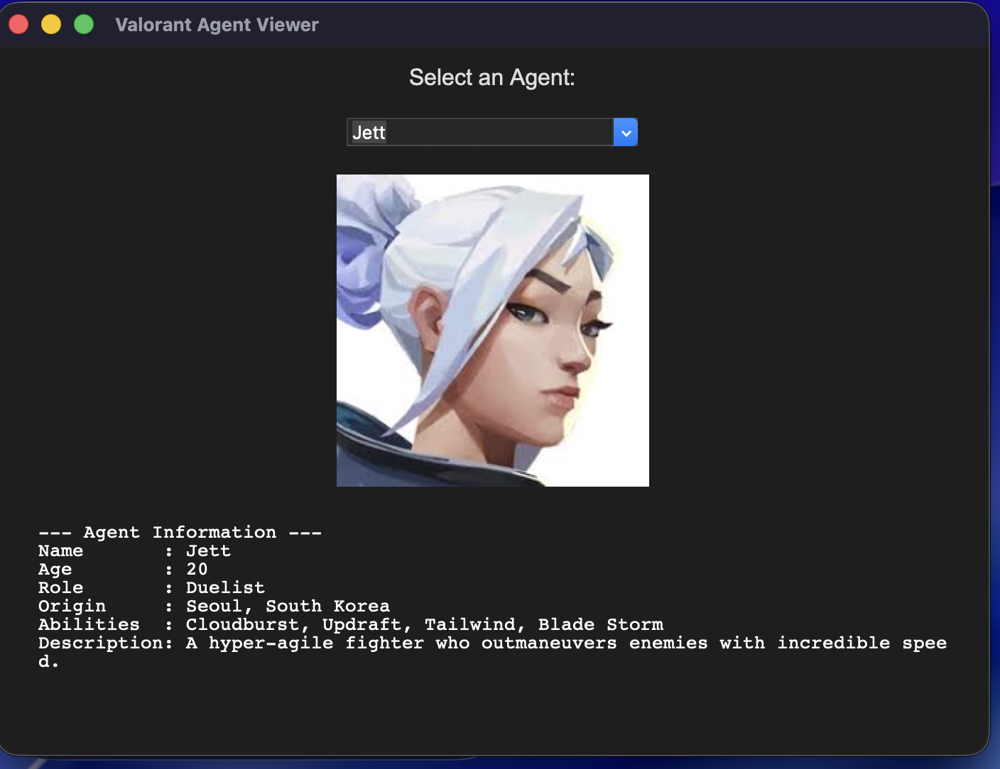

# Valorant Agent Viewer

A simple **Python GUI application** to view information and images of Valorant agents using **Tkinter** and **Pillow (PIL)**.

---

## Features

- Browse all Valorant agents via a dropdown menu.
- Display detailed information including:
  - Name
  - Age
  - Role (Category)
  - Origin (Country)
  - Abilities
  - Description
- Show agent image alongside the information.
- Handles missing images gracefully.

---

## Screenshots



---
## File Structure
``` 
Valorant-Agent-Viewer/        <-- Root project folder
├─ images/                    <-- Folder for all agent images
│  ├─ Brimstone.jpeg
│  ├─ Phoenix.jpeg
│  ├─ Sage.jpeg
│  ├─ ss-jett.jpeg
│  └─ ... (other agent images)
├─ main.py                    <-- Your main Python GUI code
└─ README.md                  <-- Project documentation
```

## Installation

1. Clone this repository:

```bash
git clone https://github.com/DevGopi-17/valorant-agent-viewer.git
cd valorant-agent-viewer
